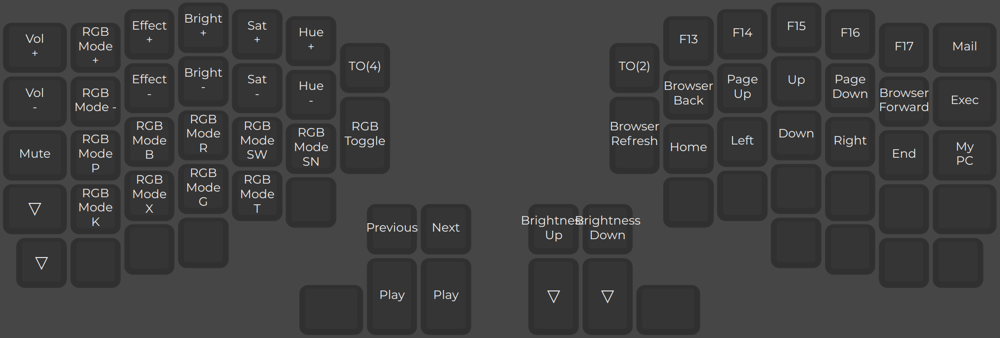

## Keyboard configuration

This repo contains my presets, macros and configurations for the **[QMK Firmware](https://github.com/qmk/qmk_firmware)** running in my implementation of the **[Redox Keyboard](https://github.com/mattdibi/redox-keyboard/tree/master)**

---

# Keymap
## Layer 0 - QERTY

## Layer 1 - Symbols, F-keys and Numpad

## Layer 2 - Navigation, Media and RGB Control

## Layer 3 - Mouse keys and arduino reset

### Info
It's using `caterina` as bootloader.

### Steps
 - Install QMK CLI tool - `$python3 -m pip install --user qmk`
 - `$ qmk config user.keyboard=redox/rev1`
 - `$ qmk config user.keymap=Feko`
 - `$ qmk compile`
 - `$ qmk flash`
 - Hold **both shift keys** and press `B` to enter bootloader mode

### Troubleshoot
Under Arch, the `flash` action stuck in the message: `Waiting for /dev/ttyACM0 to become writable..................................`

The device `/dev/ttyACM0` exists for just a couple of seconds after entering bootloader and then it vanishes. During this a few seconds, find which group is needed for your user: `$ ls -hla /dev/tty*`

Then, add the group to your user: `$ sudo usermod -aG <group> <user>`

Lastly, enable writing on the device: `$ sudo chmod o+rw /dev/ttyACM0` - This command has to be sent when the `qmk flash` action is waiting for the device, and in those couple seconds the device exists after entering bootloader mode.